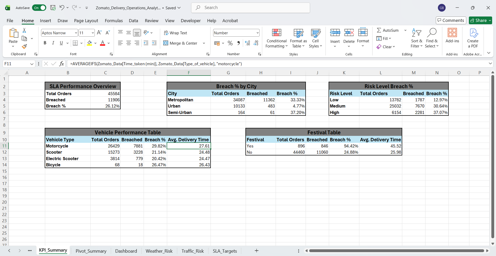
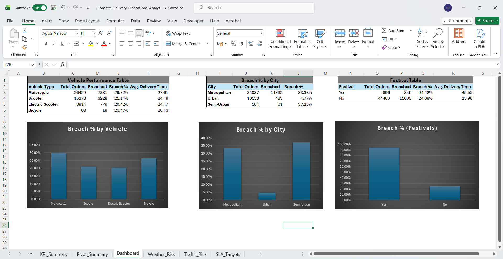

# Zomato Delivery Operations Analytics (Excel)

Delivery Operations Dataset (Kaggle). Analyzed 45,584 orders to track SLA Breach Rate, Delivery Risk Level (Weather & Traffic), Vehicle Performance, and Festival Day Demand Impact.

## Project Overview

This project examines what drives delivery delays and SLA breaches for a Zomato style food delivery operation, and how vehicle type, weather, traffic, and festival demand affect performance across 45,584 orders.

**Central Questions:**
1. What conditions (weather, traffic, festival, city type) most impact delivery time?
2. Which vehicle types deliver most reliably?
3. How often are SLA targets breached, and where does it happen most?
4. Does city type alone explain delivery performance, or do external conditions matter more?

## Key KPIs

- Overall SLA Breach Rate
- Breach % by City
- Breach % by Risk Level (Weather + Traffic severity)
- Vehicle Performance (Breach % and Avg. Delivery Time by vehicle type)
- Festival vs. Non-Festival Breach % and Avg. Delivery Time

## Key Insights

*(Source: KPI_Summary sheet unless noted)*

- **Overall SLA breach rate: 26.12%** (11,906 of 45,584 orders) — *SLA Performance Overview table*
- **Festival days see a 94.42% breach rate** vs. 24.88% on non-festival days which is nearly a 4x spike, despite festival orders being only ~2% of total volume (896 of 45,584 orders) — *Breach% (Festival) table*
- **Risk Level directly predicts breach likelihood:** Low risk conditions breach 12.97% of the time; High risk conditions breach 37.07% showing a clear, monotonic relationship validating the weather/traffic scoring model — *Risk Level Breach % table*
- **Motorcycles have the highest breach rate (29.82%)** among vehicle types, despite being the most-used vehicle; Scooters (21.14%) and Electric Scooters (20.42%) perform notably better — *Vehicle Performance Table*
- **Semi-Urban and Metropolitan cities breach SLA far more than Urban** (37.20% and 33.33% vs. just 4.77%) — *Breach % by City table*. Notably, Metropolitan's average delivery time (27.31 min) is lower than Semi-Urban's (49.73 min), yet both breach at a similar rate to each other and far more than Urban showing that raw speed and SLA breach rate aren't driven by the same factors *(Pivot_Summary sheet, Average Delivery Time by City)*
- **Traffic density affects delivery time more than weather condition** — the worst individual combination is Fog + Traffic Jam (36.81 min average) — *Pivot_Summary sheet, Average Delivery Time by Weather & Traffic*

## Skills Demonstrated

- **Lookup & Reference:** XLOOKUP (SLA target lookup, Weather/Traffic risk scoring)
- **Logical:** IF, Nested IF (SLA status, Risk Level classification)
- **Text:** PROPER, SUBSTITUTE (vehicle type standardization)
- **Math & Aggregation:** COUNTIF, COUNTIFS, AVERAGEIFS
- **Data Organization:** Data cleaning (Text to Columns, Find & Replace), Custom Number Formatting, Structured Table references
- **Visual & Analytical Tools:** PivotTables, Conditional Formatting (heatmap), Column Charts

## Project Walkthrough

### Step 1 — Data Cleaning

- The source file contained the literal text string `"NaN"` (not true blank cells) across 8 columns — `Delivery_person_Age`, `Delivery_person_Ratings`, `Time_Orderd`, `Weather_conditions`, `Road_traffic_density`, `multiple_deliveries`, `Festival`, `City` (9,131 instances total). These were converted to genuine blank cells via Find & Replace.
- `Order_Date`, `Time_Ordered`, and `Time_Order_picked` required type verification and consistent time formatting.
- `Type_of_vehicle` values were inconsistently capitalized and underscore-separated (e.g., `electric_scooter`) — cleaned using `PROPER` + `SUBSTITUTE`.
- A small number of rows have missing City/Weather/Traffic data; these are retained but excluded from relevant breakdowns/charts rather than imputed.

### Step 2 — SLA & Risk Scoring

- **SLA targets** (Metropolitan: 30 min, Urban: 40 min, Semi-Urban: 50 min) are assumption based benchmarks defined for this analysis, not part of the original dataset, based on general food delivery industry delivery time expectations. Pulled into the dataset via XLOOKUP, compared against actual delivery time via IF to flag Breached/Within SLA.
- **Risk Level** is a composite score built from two independent, equally-weighted reference tables (Weather severity 1–3, Traffic severity 1–3), combined into a single Low/Medium/High rating per order via XLOOKUP + nested IF. Like the SLA targets, these severity scores are assumption based judgments made for this analysis (e.g., Sunny=1, Stormy=3; Low traffic=1, Jam=3), not values provided by the original dataset.

### Step 3 — KPI Summary & Pivot Analysis

- Built KPI tables (SLA Overview, Breach % by City, Breach % by Risk Level, Vehicle Performance, Festival comparison) using COUNTIF/COUNTIFS and AVERAGEIFS.
- Built PivotTables for Average Delivery Time by City, and a Weather × Traffic cross-tab with conditional formatting heatmap.

### Step 4 — Charts

- Column charts for Breach % by Vehicle, Breach % by City, and Breach % (Festival).

## Dataset

Source: [Zomato Delivery Operations Analytics Dataset — Kaggle](https://www.kaggle.com/datasets/saurabhbadole/zomato-delivery-operations-analytics-dataset), by Saurabh Badole (45,584 rows, 20 columns).

## Tools Used

- Microsoft Excel (XLOOKUP, PivotTables, Conditional Formatting, Column Charts, Structured Tables, Data Cleaning)

## Files

- `Zomato_Delivery_Operations_Analytics.xlsx` — full workbook (raw data, cleaned data, KPI summary, pivot tables, charts)
- `Zomato Dataset(RAW).png`
- `Zomato Dataset(Clean).png`
- `KPI_Summary.png`
- `Pivot Summary.png`
- `Dashboard.png`

---

*Built by Gargi Barman | Aspiring Operations Analyst*
